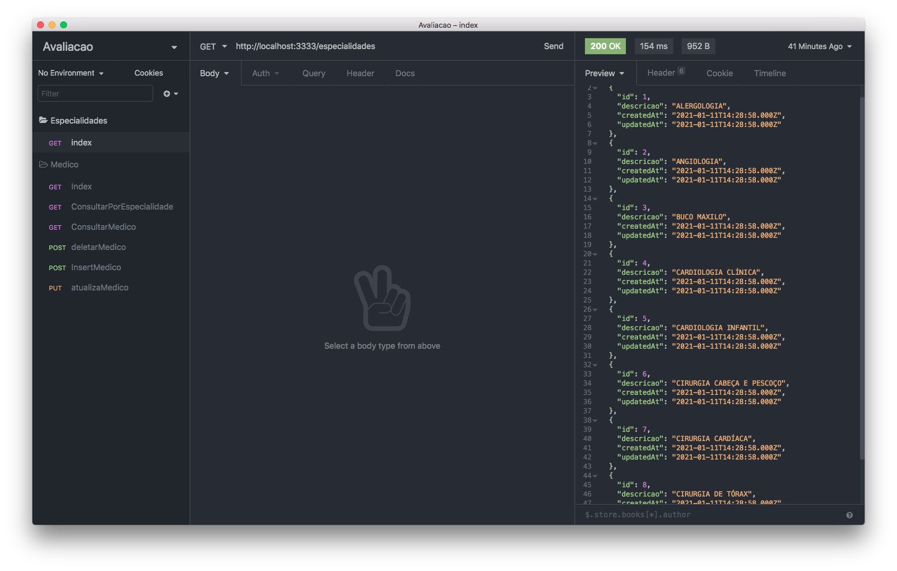
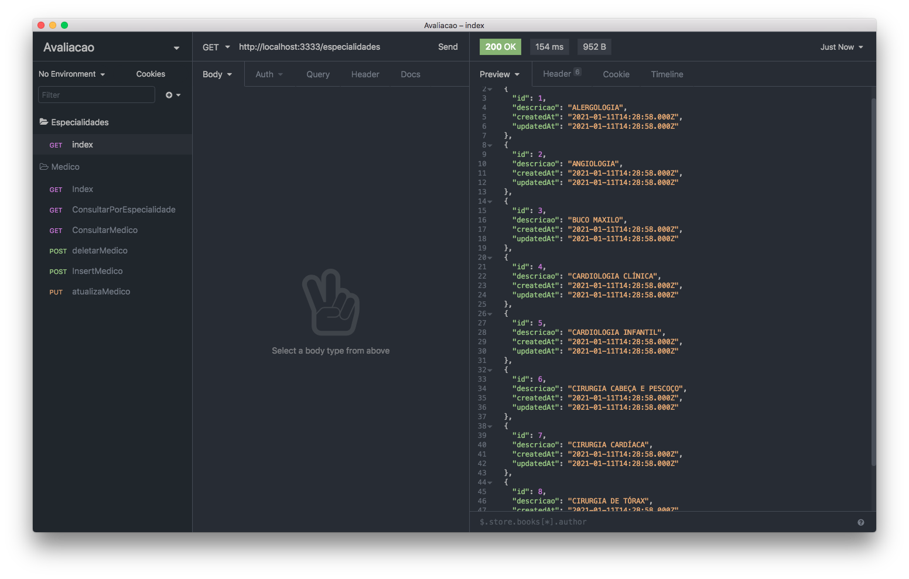
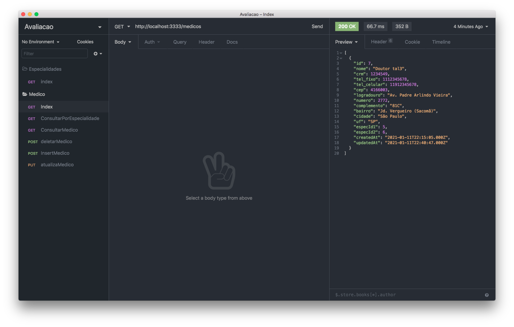
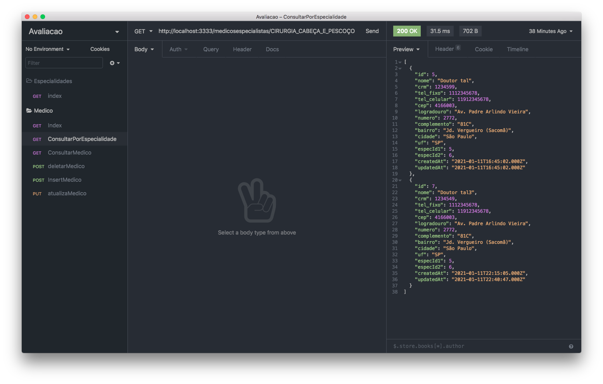
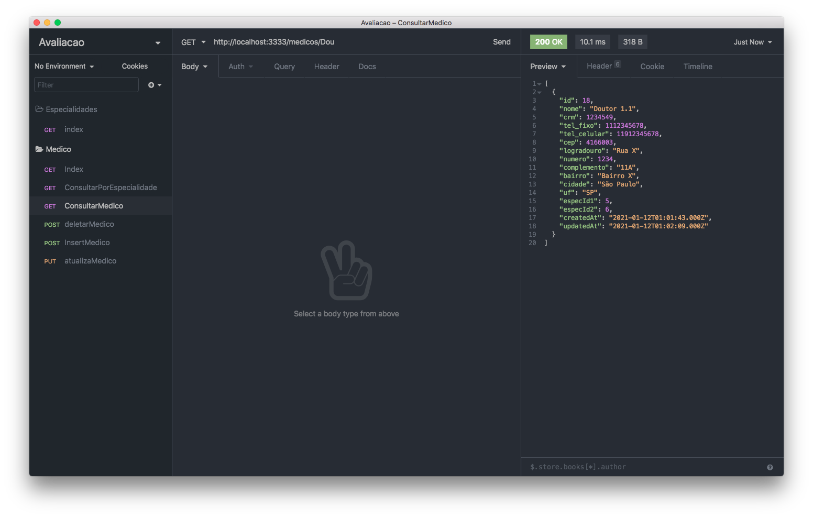
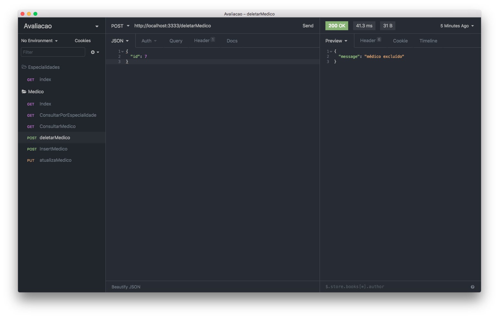
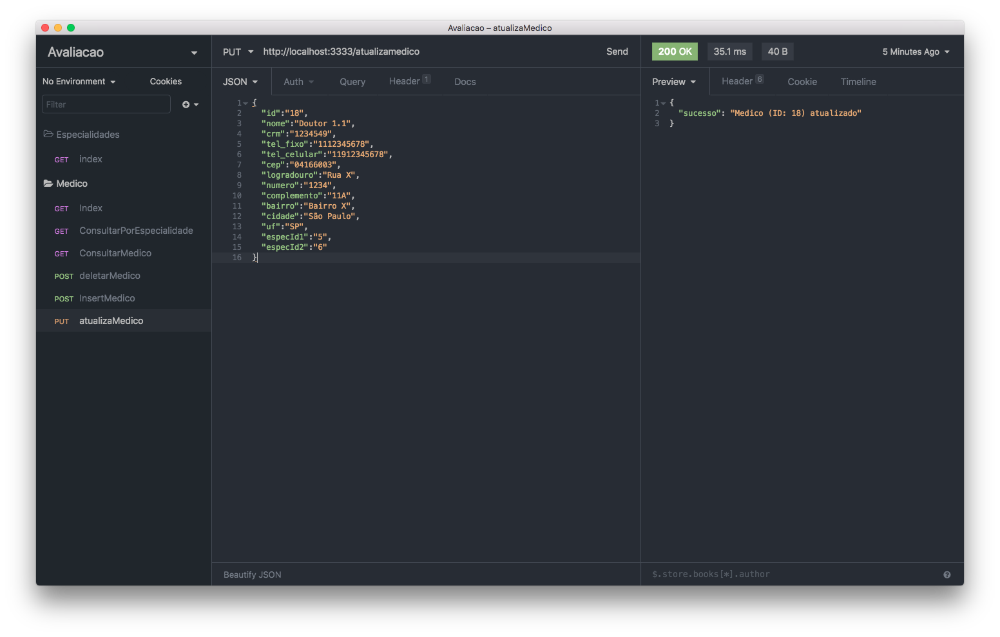

# Documentação API do MedicalManagement

**Instalação**:

Para instalar o projeto:

```powershell
npm install
```

Após isso:

```powershell
npx sequelize-cli db:migrate
```

E para executar o projeto:

```powershell
yarn dev
```

A aplicação irá funcionar na porta 3333 (http://localhost:3333)

**Especialidades**:

**Index**

Criei uma API para caso algum desenvolvedor queira saber qual os IDs das especialidades dos médicos

Endpoint: [http://localhost:3333/especialidades](http://localhost:3333/especialidades)

Exemplo:


=======


**Medicos**:

**Index**

Para listar todos os médicos:

Método: GET

Endpoint: [http://localhost:3333/medicos](http://localhost:3333/medicos)



**ConsultarPorEspecialidade**

Para consultar os médicos por Especialidade

Método GET

Endpoint [http://localhost:3333/medicosespecialistas/](http://localhost:3333/medicosespecialistas/CIRURGIA_CABE%C3%87A_E_PESCO%C3%87O) + <ESPECIALIDADE> (com palavras separadas por _)

Exemplo: [http://localhost:3333/medicosespecialistas/CIRURGIA_CABEÇA_E_PESCOÇO](http://localhost:3333/medicosespecialistas/CIRURGIA_CABE%C3%87A_E_PESCO%C3%87O)



**ConsultarMedico**

Esse método é para pesquisar os médicos por qualquer campo como nome, crm, celular, etc (Com exceção das especialidades)

Método: GET
Endpoint [http://localhost:3333/medicos/](http://localhost:3333/medicos/Doutor_tal3) +< CONTEUDO A SER PESQUISADO >(com palavras separadas por _)

Exemplo: [http://localhost:3333/medicos/Doutor_tal3](http://localhost:3333/medicos/Doutor_tal3)



**DeletarMedico**

Para exclusão de Médicos da base de dados

Método: POST

Endpoint: [http://localhost:3333/deletarMedico](http://localhost:3333/deletarMedico)

Deve ser enviado no body o ID do médico:



**InsertMedico**

Para criação de um novo médico na base de dados:

Método: POST

Endpoint: [http://localhost:3333/medicos](http://localhost:3333/medicos)

No corpo da requisição deve ser enviado os seguintes campos:

```json
{
	"nome": string[120],
	"crm": int[8],
	"tel_fixo": int[11],
	"tel_celular": int[11],
	"cep": int[8],
	"logradouro": string,
	"numero": int,
	"complemento": string,
	"bairro": string,
	"cidade": string,
	"uf": string[2],
	"especId1": int, (Vide Especialidades/Index)
	"especId2": int
}
```

Exemplo:


**AtualizaMedico**

Para atualização do Médico na base de dados:

Método: PUT

Endpoint: [http://localhost:3333/atualizamedico](http://localhost:3333/atualizamedico)

No corpo da requisição deve ser enviado o id do médico a ser atualizado e todas as novas informações referente a ele:

```json
{

	"id": int
	"nome": string[120],
	"crm": int[8],
	"tel_fixo": int[11],
	"tel_celular": int[11],
	"cep": int[8],
	"logradouro": string,
	"numero": int,
	"complemento": string,
	"bairro": string,
	"cidade": string,
	"uf": string[2],
	"especId1": int, (Vide Especialidades/Index)
	"especId2": int

}
```




